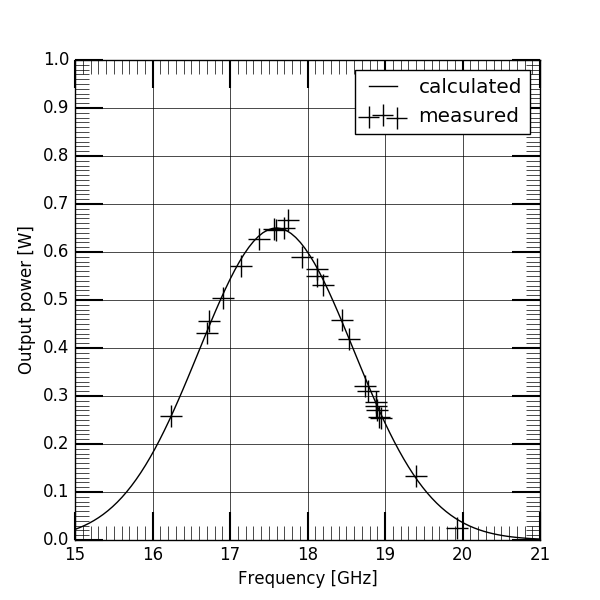
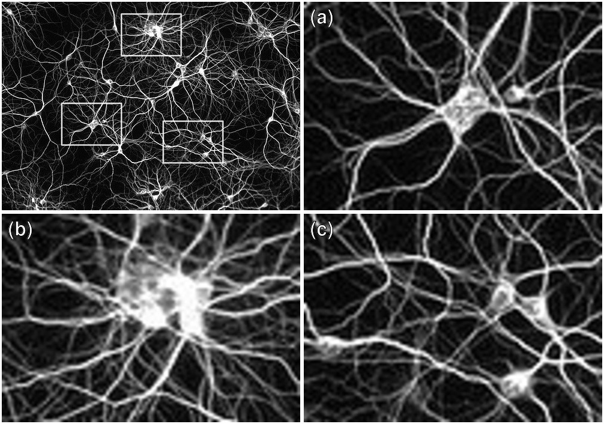
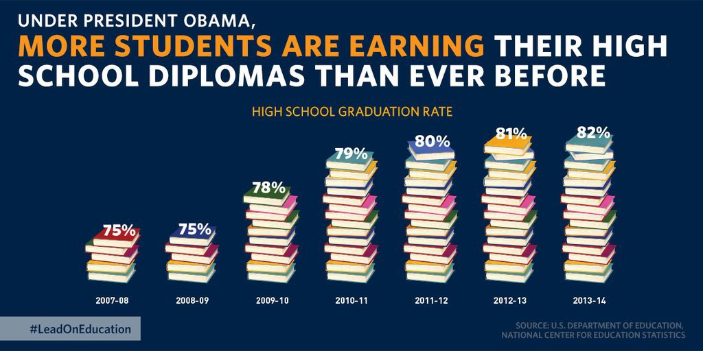

# Scientific visualization

[Nicolas P. Rougier](http://www.labri.fr/perso/nrougier),
[G-Node summer school](https://python.g-node.org/),
Camerino, Italy , 2018

> *Visualisation is a method of computing. It transforms the symbolic into the
> geometric, enabling researchers to observe their simulations and
> computations. Visualisation offers a method for seeing the unseen. It
> enriches the process of scientific discovery and fosters profound and
> unexpected insights.*
> 
> — **Visualisation in Scientific Computing**, NSF report, 1987.


Scientific visualization is classically defined as the process of graphically
displaying scientific data. However, this process is far from direct or
automatic. There are so many different ways to represent the same data: scatter
plots, linear plots, bar plots, and pie charts, to name just a few.
Furthermore, the same data, using the same type of plot, may be perceived very
differently depending on who is looking at the figure. A more accurate
definition for scientific visualization would be a graphical interface between
people and data. But remember, there are two people in the loop: the one that
produces the visualization and the one that watches it. What you intend to show
might be quite different from what will be actually perceived...

The goal of [this course](./slides.pdf) is to introduce a few concepts in order
for you to achieve better visualization. If you want to go further, you'll have
to look at the miscellaneous references given at the end of this document.


**Table of Contents**

* [Tutorial](#tutorial)
* [Exercises](#exercises)
* [References](#references)
* [Solutions](#solutions)


## Tutorial

Please go to the [Matplotlib tutorial](http://www.labri.fr/perso/nrougier/teaching/matplotlib/matplotlib.html) page.


## Exercises

### Too much ink

Consider the following figure and, using matplotlib, try to remove as much ink
as you can while keeping the most relevant information.



You can start from the following python script:


```
import numpy as np
import matplotlib.pyplot as plt

np.random.seed(123)

def gaussian(x, a, x0, sigma):
    return a*np.exp(-(x-x0)**2/(2*sigma**2))

# Clean data
X = np.linspace(15, 21, 100)
Y = gaussian(X, 0.65, 17.6, 1.)

# Noisy dat
Xn = np.random.uniform(16, 20, 25)
Yn = gaussian(Xn, 0.65, 17.6, 1.) + 0.01 * np.random.normal(size=len(Xn))
```


### The right tool

You have a nice [image](neurons.jpg) and you would like to show labeled
detailed sub-images alongside the main image (see below). What could be the
easiest way to do that ? Be careful with the labels, they must be visible
independently of the images color/contrast.




### Misleading

What's wrong with this graphic ? How would you correct it ?




### Editor's request

Your article just been accepted but the editor request figure 2 to be at least
300 dpi. What does that mean ? What is the minium size (in pixels) of your
figure ? Is it relevant if you figure has been saved in vector format ?


### Replication

Look at [Drawing a brain with
Bokeh](http://merqur.io/2015/10/02/drawing-a-brain-with-bokeh/) and try to
replicate the final figure using matpltolib.

**or**

Pick one of your favorite graphic from the litterature and try to replicate it
using matplotlib (and fake data).


## References
  
There exist many online resources about scientific visualization and a lot of
excellent books as well. Since you probably not have time to read everything, I
collected a small set of resources that might be read relatively rapidly.
  
### Made with matplotlib

* [Wind map](https://github.com/rougier/windmap)
* [Alien life](https://github.com/rougier/alien-life)
* [Pendulum](https://github.com/rougier/pendulum)
* [Less is more](https://github.com/rougier/less-is-more)
* [Anatomy of a figure](https://github.com/rougier/figure-anatomy)
* [Ten simple rules for better figures (code)](https://github.com/rougier/ten-rules)
  
### Courses/Tutorials/Guides

* [Matplotlib tutorial](http://www.labri.fr/perso/nrougier/teaching/matplotlib/matplotlib.html), N.P. Rougier, 2016.
* [Ten simple rules for better figures (article)](http://journals.plos.org/ploscompbiol/article?id=10.1371/journal.pcbi.1003833),
  N.P. Rougier, M. Droettboom, P.E. Bourne, 2014.
* [Scientific Visualization course](http://www.cspaul.com/wordpress/course-vis-2015/), Paul Rosen, 2015.
* [Information Visualization](http://www.cs.ubc.ca/~tmm/courses/infovis/slides/intro.pdf), T. Munzner, 2015.
* [The Quartz guide to bad data](https://github.com/Quartz/bad-data-guide),
  C. Groskopf, 2015.
* [Quantitative vs. Categorical Data: A Difference Worth Knowing](https://www.perceptualedge.com/articles/dmreview/quant_vs_cat_data.pdf), S. Few , 2005.
* [How to make beautiful data visualizations in Python with matplotlib](http://www.randalolson.com/2014/06/28/how-to-make-beautiful-data-visualizations-in-python-with-matplotlib/), Randy Olson, 2014.

### (Some) Tools

* [Matplotlib](http://www.aosabook.org/en/matplotlib.html),
  J. Hunter and M. Droettboom, 2010.
* [10 Useful Python Data Visualization Libraries for Any Discipline](https://blog.modeanalytics.com/python-data-visualization-libraries/), M. Bierly, 2016.
* [Datavisualization.ch](http://selection.datavisualization.ch), 2015.
* [Data visualization catalogue](http://www.datavizcatalogue.com/index.html),
  S. Ribecca, 2016.
* [Fred's ImageMagick script](http://www.fmwconcepts.com/imagemagick/), F. Weinhaus, 2016.
* [Ti*k*Z and PGF](http://www.texample.net/tikz/), Stefan Kottwitz

### Books

* [Python & OpenGL for Scientific Visualization](http://www.labri.fr/perso/nrougier/python-opengl/), Nicolas Rougier, 2018
* [Fundamentals of Data Visualization](https://serialmentor.com/dataviz/), Claus O. Wilke, 2017
* [Visualization Analysis and Design](http://www.cs.ubc.ca/~tmm/vadbook/) ($),
  T. Munzner, 2014.
* [Trees, maps, and theorems](http://www.treesmapsandtheorems.com) ($),
  J.-L. Doumont, 2009.
* [The Visual Display of Quantitative Information](https://www.edwardtufte.com/tufte/books_vdqi) ($), E.R. Tufte, 1983.

### Good examples

* [A Tour through the Visualization Zoo](http://queue.acm.org/detail.cfm?id=1805128), J. Heer, M. Bostock, and V. Ogievetsky, 2010.
* [The most misleading charts of 2015, fixed](http://qz.com/580859/the-most-misleading-charts-of-2015-fixed/), K. Collins, 2015.
* [Data is beautiful](https://www.reddit.com/r/dataisbeautiful/) / reddit.


### Bad examples (don't do that at home)

* [Junk charts](http://junkcharts.typepad.com), K. Fung, 2005-2016.
* [WTF Visualizations](http://viz.wtf), community supported.
* [How to Display Data Badly](http://www.jstor.org/stable/2683253), H. Wainer, 1984.
* [Effective graphical displays](http://www.treesmapsandtheorems.com/pdfs/TM&Th-4.0-summary.pdf), Jean-Luc Doumont, 2009.


## Solutions

1. [exercise-1-sol.py](exercise-1-sol.py) / [exercise-1-sol.png](exercise-1-sol.png)
   (adapted from "Trees, maps, and theorems")
2. [exercise-2-sol.sh](exercise-2-sol.sh) or [exercise-2-sol.py](exercise-2-sol.py)
3. [exercise-3-sol.py](exercise-3-sol.py) / [exercise-3-sol.png](exercise-3-sol.png)
   (adapted from "The most misleading charts of 2015, fixed")
4. [exercise-4-sol.md](exercise-4-sol.md) or [exercise-4-sol.py](exercise-4-sol.py)
5. [exercise-5-sol.py](exercise-5-sol.py) / [exercise-5-sol.png](exercise-5-sol.png) 

