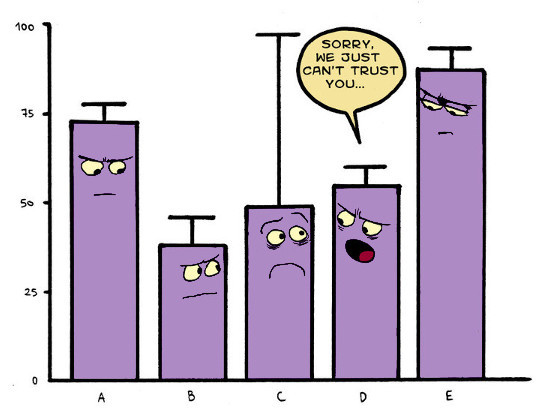
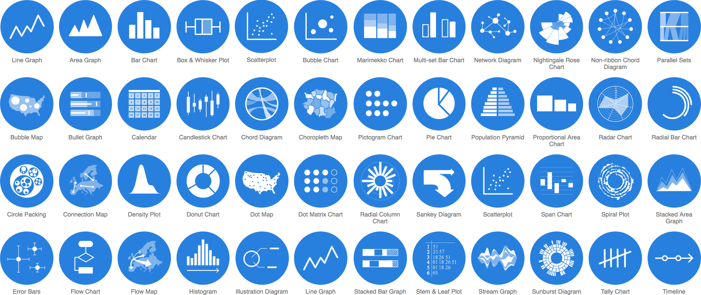
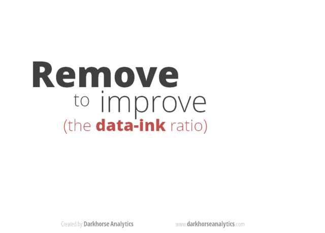
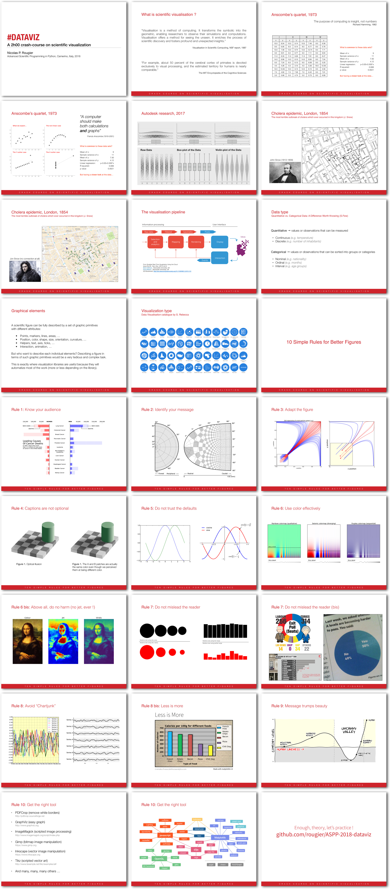

# Scientific visualization
A 2h00 crash course on scientific visualization.  
[Nicolas P. Rougier](http://www.labri.fr/perso/nrougier),
[G-Node summer school](https://python.g-node.org/),
Camerino, Italy , 2018


[](http://velica.deviantart.com/art/Error-bars-101948712)  


"*Visualisation is a method of computing. It transforms the symbolic into the geometric, enabling researchers to observe their simulations and computations. Visualisation offers a method for seeing the unseen. It enriches the process of scientific discovery and fosters profound and unexpected insights.*"
 
Visualisation in Scientific Computing, NSF report, 1987.

## Introduction

Scientific visualization is classically defined as the process of graphically
displaying scientific data. However, this process is far from direct or
automatic. There are so many different ways to represent the same data: scatter
plots, linear plots, bar plots, and pie charts, to name just a
few. Furthermore, the same data, using the same type of plot, may be perceived
very differently depending on who is looking at the figure. A more accurate
definition for scientific visualization would be a graphical interface between
people and data. But remember, there are two people in the loop: the one that
produces the visualization and the one that watches it. What you intend to show
might be quite different from what will be actually perceived...

The goal of this crash course is to introduce a few concepts in order for you
to achieve better visualization (hopefully). If you want to go further, you'll
have to look at the miscellaneous references given at the end of this document.

## Visualization pipeline

The visualization pipeline describes the process of creating visual
representations of data, from the raw data up to the final rendering. There is
no unique definition of such pipeline but most of the time you'll find at least
3 steps (filter, map, render). 

1. Raw data (whatever...)
2. Filtered data (missing, noise, analytics, statistics, ...)
3. Mapped data (geometry, attributes, colors, ...)
4. Rendered data (static image, interactive display, ...)


## Data type

The nature of the data has a great influence on the kind of visualization you
can use. Traditionally, they are split as:

**Quantitative** (values or observations that can be measured)

  * Continuous  
  * Discrete  

**Categorical** (values or observations that can be sorted into groups or
categories)

  * Nominal  
  * Ordinal  
  * Interval  

but you can also find finer detailed descriptions in the litterature.


## Graphical elements

In the end, a scientific figures can be fully described by a set of
graphic primitives with different attributes:

* Points, markers, lines, areas, ...
* Position, color, shape, size, orientation, curvature, ...
* Helpers, text, axis, ticks,
* Interaction, animation

But describing a figure in terms of such graphic primitive would be a very
tedious and complex task. This is exactly where visualization libraries or
software are useful because they will automatize most of the work, more
(e.g. [seaborn](https://stanford.edu/~mwaskom/software/seaborn/)) or less
(e.g. [matplotlib](http://matplotlib.org)) depending on the library. In the
ideal case, you want to only specify your data and let the library decides of almost everything (e.g. [vega-lite](https://vega.github.io/vega-lite/))


## Visualization type


From the [Data visualization catalogue](http://www.datavizcatalogue.com/index.html) by Severino Ribecca.


## Less is more

*Perfection is achieved not when there is nothing more to add, but when there is nothing left to take away* – Antoine de Saint-Exupery




## Ten simple rules

From [Ten simple rules for better figures](http://journals.plos.org/ploscompbiol/article?id=10.1371/journal.pcbi.1003833), N.P. Rougier, M. Droettboom, P.E. Bourne, 2014.


1. Know your audience
2. Identify Your Message
3. Adapt the Figure to the Support Medium
4. Captions Are Not Optional
5. Do Not Trust the Defaults
6. Use Color Effectively
7. Do Not Mislead the Reader
8. Avoid “Chartjunk”
9. Message Trumps Beauty
10. Get the Right Tool


## Crash course

[](./slides.pdf)


----

## Exercices

### Exercise 1: Too much ink...

Consider the following figure and, using matplotlib, try to remove as much ink
as you can while keeping the most relevant information.


You can start from the following python script:


```
import numpy as np
import matplotlib.pyplot as plt

np.random.seed(123)

def gaussian(x, a, x0, sigma):
    return a*np.exp(-(x-x0)**2/(2*sigma**2))

# Clean data
X = np.linspace(15, 21, 100)
Y = gaussian(X, 0.65, 17.6, 1.)

# Noisy dat
Xn = np.random.uniform(16, 20, 25)
Yn = gaussian(Xn, 0.65, 17.6, 1.) + 0.01 * np.random.normal(size=len(Xn))
```

### Exercise 2: Using the right tool

You have a nice [image](neurons.jpg) and you would like to show labeled
detailed sub-images alongside the main image (see below). What could be the
easiest way to do that ? Be careful with the labels, they must be visible
independently of the images color/contrast.


### Exercise 3: Misleading the reader

What's wrong with this graphic ? How would you correct it ?


### Exercise 4: Editor request

Your article just been accepted but the editor request figure 2 to be at least
300 dpi. What does that mean ? What is the minium size (in pixels) of your
figure ? Is it relevant if you figure has been saved in vector format ?


### Exercise 5: Replication

Look at
[Drawing a brain with Bokeh](http://merqur.io/2015/10/02/drawing-a-brain-with-bokeh/)
and try to replicate the final figure using matpltolib.

**or**

Pick one of your favorite graphic from the litterature and try to replicate it
using matplotlib (and fake data).


----

<!---------------------------------------------------------------------------->

## References
  
There are any online resources about scientific visualization and a lot of
excellent books as well. Since you probably not have time to read everything, I
collected a small set of resources that might be read relatively rapidly.
  
**Made with matplotlib**

* [Wind map](https://github.com/rougier/windmap)
* [Alien life](https://github.com/rougier/alien-life)
* [Less is more](https://github.com/rougier/less-is-more)
* [Anatomy of a figure](https://github.com/rougier/figure-anatomy)
* [Ten simple rules for better figures (code)](https://github.com/rougier/ten-rules)
  
**Courses/Tutorials/Guides**  

* [Matplotlib tutorial](http://www.labri.fr/perso/nrougier/teaching/matplotlib/matplotlib.html), N.P. Rougier, 2016.
* [Ten simple rules for better figures (article)](http://journals.plos.org/ploscompbiol/article?id=10.1371/journal.pcbi.1003833),
  N.P. Rougier, M. Droettboom, P.E. Bourne, 2014.
* [Scientific Visualization course](http://www.cspaul.com/wordpress/course-vis-2015/), Paul Rosen, 2015.
* [Information Visualization](http://www.cs.ubc.ca/~tmm/courses/infovis/slides/intro.pdf), T. Munzner, 2015.
* [The Quartz guide to bad data](https://github.com/Quartz/bad-data-guide),
  C. Groskopf, 2015.
* [Quantitative vs. Categorical Data: A Difference Worth Knowing](https://www.perceptualedge.com/articles/dmreview/quant_vs_cat_data.pdf), S. Few , 2005.
* [How to make beautiful data visualizations in Python with matplotlib](http://www.randalolson.com/2014/06/28/how-to-make-beautiful-data-visualizations-in-python-with-matplotlib/), Randy Olson, 2014.
* [Fundamentals of Data Visualization](https://serialmentor.com/dataviz/)

**(Some) Tools**  

* [Matplotlib](http://www.aosabook.org/en/matplotlib.html),
  J. Hunter and M. Droettboom, 2010.
* [10 Useful Python Data Visualization Libraries for Any Discipline](https://blog.modeanalytics.com/python-data-visualization-libraries/), M. Bierly, 2016.
* [Datavisualization.ch](http://selection.datavisualization.ch), 2015.
* [Data visualization catalogue](http://www.datavizcatalogue.com/index.html),
  S. Ribecca, 2016.
* [Fred's ImageMagick script](http://www.fmwconcepts.com/imagemagick/), F. Weinhaus, 2016.
* [Ti*k*Z and PGF](http://www.texample.net/tikz/), Stefan Kottwitz

**Books**  

* [Visualization Analysis and Design](http://www.cs.ubc.ca/~tmm/vadbook/),
  T. Munzner, 2014.
* [Trees, maps, and theorems](http://www.treesmapsandtheorems.com),
  J.-L. Doumont, 2009.
* [The Visual Display of Quantitative Information](https://www.edwardtufte.com/tufte/books_vdqi), E.R. Tufte, 1983.

**Good examples**  

* [A Tour through the Visualization Zoo](http://queue.acm.org/detail.cfm?id=1805128), J. Heer, M. Bostock, and V. Ogievetsky, 2010.
* [The most misleading charts of 2015, fixed](http://qz.com/580859/the-most-misleading-charts-of-2015-fixed/), K. Collins, 2015.
* [Data is beautiful](https://www.reddit.com/r/dataisbeautiful/) / reddit.


**Bad examples (don't do that at home)**  

* [Junk charts](http://junkcharts.typepad.com), K. Fung, 2005-2016.
* [WTF Visualizations](http://viz.wtf), community supported.
* [How to Display Data Badly](http://www.jstor.org/stable/2683253), H. Wainer, 1984.

<!--
* [Effective graphical displays](http://www.treesmapsandtheorems.com/pdfs/TM&Th-4.0-summary.pdf), Jean-Luc Doumont, 2009.
* [Effects on Different Types of Textile on Sexual Activity](http://www.moosecraft.org/Rat/RatPaper.pdf), Ahmed Shafik, European Urology, 1993.
-->

----

<!---------------------------------------------------------------------------->
## Solutions to the exercises

1. [exercise-1-sol.py](exercise-1-sol.py) / [exercise-1-sol.png](exercise-1-sol.png)  
(adapted from "Trees, maps, and theorems")
2. [exercise-2-sol.sh](exercise-2-sol.sh) or [exercise-2-sol.py](exercise-2-sol.py)
3. [exercise-3-sol.py](exercise-3-sol.py) / [exercise-3-sol.png](exercise-3-sol.png)  
(adapted from "The most misleading charts of 2015, fixed")
4. [exercise-4-sol.md](exercise-4-sol.md) or [exercise-4-sol.py](exercise-4-sol.py)
5. [exercise-5-sol.py](exercise-5-sol.py) / [exercise-5-sol.png](exercise-5-sol.png) 


